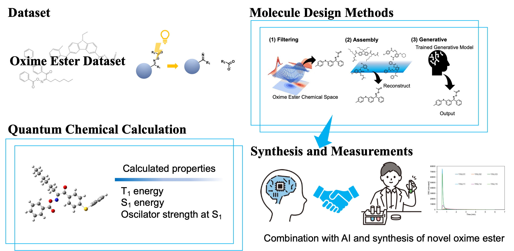

# Design Oxime Ester

## Overview

### oxime_ester_asembling

Contains the code of oxime ester assebling method

Plese refere the folowing code

./oxime_ester_assembling

### ML

Containes prediction models and generative model

- ./ML/ABT-MPNN
  Graph base prediction model

- ./ML/deepa_neuralnetwork
  Dense Neuural network

- ./ML/MolGen
  SMILES base molecule Generative model

## Supporting Information

### Evaluation functions in the Generative method

Symmetry Score
The Symmetry Score assigns canonical ranks to all atoms in a given molecule and counts the number of occurrences of each rank. Using this information, the total number of equivalent atom pairs is calculated, which is then normalized by the number of all atom pairs in the molecule to calculate the Symmetry Score. The Symmetry Score takes values between 0 and 1, with values approaching 1 indicating higher 2-dimensional symmetry of the molecule.
　The reward function based on the Symmetry Score, SR, is shown below. SS is the molecule for which the aforementioned symmetry score (m) is input.

The Symmetry Score is introduced because molecules with higher symmetry are more likely to contain multiple active sites. Specifically, a higher symmetry of the chromophore indicates a higher ease for performing Friedel-Crafts acylation over multiple sites.
Fused Ring Count Score
This score indicates the number of fused rings in a molecule and determines the number of alkyl rings within the largest fused ring. The reward function, FR, is defined as follows, where FS is the fused ring count score, and m is the input molecule.

A larger fused ring has a higher potential to host multiple active sites; therefore, they are prioritized.
Number of Aromatic Heterocycle Score
　This score indicates the number of aromatic heterocycles in the molecule. The reward function NR is defined as follows, where NS is the Num Aromatic Heterocycle Score, and m is the input molecule.

Max Ring Size Score
　This score indicates the largest ring size in the molecule. The reward function MR is set as follows, where MS is the Max Ring Size Score, and m is the input molecule.

This constraint prevents the model from designing excessively large cyclic alkyl structures.

Oxime Activation Part Score
This score indicates the number of active sites of oxime esters. The reward function NOR is defined as follows, where
m is the molecule, and NO is the number of oxime ester active sites.

	

Oxime Ester Property Score
　This score evaluates the oxime ester physical properties for a given molecule: first excited triplet energy ( T1 energy), first excited singlet energy (S1 energy), and S1 oscillator strength. As quantum chemical calculations of these values for each individual product molecule would be computationally expensive, the ABT-MPNN model is used to predict these values.
　The reward function, OR, is set as follows, where ABTMPNNT1 is the T1 energy output by ABTMPNN, ABTMPNNS1 is the S1 energy output by ABTMPNN, and ABTMPNNS1osc is the S1 oscillator strength output by ABTMPNN. Although the model simultaneously outputs these values, they are represented as separate terms for notational convenience. Specifically, these functions do not exist independently and are strictly one function.

### Synthetic Routes

F-01

Schema S2 Synthesis root of F-01

For the first step of the synthesis, the starting 4-methylbenzophenone derivative is dissolved in ethanol, followed by the addition of hydroxylamine hydrochloride (NH2OH•HCl). The reaction mixture is heated to 80°C and maintained at this temperature until the reaction reaches completion. After cooling to room temperature, the intermediate amine product is isolated and purified.
In the second step, the purified amine intermediate is dissolved in dichloromethane (DCM). Pyridine is added as a base to the solution. The acyl chloride is then added dropwise to the reaction mixture, which is stirred at room temperature. Upon completion of the reaction, standard workup procedures are performed, and the final N-acylated product is purified using appropriate methods.
Throughout both steps, reaction progress should be carefully monitored using appropriate analytical methods. Standard inert atmosphere techniques may be employed if the reagents are moisture sensitive. Care should be taken during the acyl chloride addition to control the exothermic nature of the reaction.

F-02

Schema S3 Synthesis root of F-02

The synthesis begins with 2-acetonaphthone dissolved in ethanol. To this solution, hydroxylamine hydrochloride (NH2OH•HCl) is added, and the reaction mixture is heated to 80°C. The reaction is maintained at this temperature until completion, yielding the corresponding oxime intermediate. After cooling to room temperature, the oxime product is isolated and purified.
For the second step, the purified oxime intermediate is dissolved in dichloromethane (DCM). Pyridine is added to the solution as a base. The acetyl chloride is then carefully added dropwise to the reaction mixture at room temperature. The reaction is stirred until completion, followed by appropriate workup procedures. The final N-acetylated oxime product is then isolated and purified using suitable methods.
Throughout the synthesis, the reaction progress should be monitored using appropriate analytical techniques. The addition of acetyl chloride should be performed carefully to control the exothermic nature of the reaction.

A-01

Schema S4 Synthesis root of A-01
The synthesis begins with phenothiazine, which undergoes an aryl iodide coupling reaction. The phenothiazine is combined with 4-iodotoluene in the presence of copper(I) chloride and potassium carbonate. The reaction mixture is heated to reflux in N-methyl-2-pyrrolidone for the cross-coupling reaction to proceed, yielding the N-arylated phenothiazine intermediate.
In the second step, the N-arylated phenothiazine intermediate undergoes a Friedel-Crafts acylation. The substrate is treated with hexanoyl chloride under appropriate conditions to introduce two hexanoyl groups at the 3 and 7 positions of the phenothiazine core, producing the diketone intermediate.
The third step involves the conversion of both ketone groups to oximes. The diketone intermediate is dissolved in ethanol, and hydroxylamine hydrochloride (NH2OH•HCl) is added. The reaction mixture is heated to 80°C until the conversion is complete, forming the dioxime product.
In the final step, both oxime groups are acetylated. The dioxime intermediate is dissolved in dichloromethane (DCM), and triethylamine (TEA) is added as a base. Acetyl chloride is then carefully added dropwise at room temperature. The reaction is stirred until completion, yielding the final bis-N-acetylated oxime product.
Each step requires appropriate workup and purification procedures. The reaction progress should be monitored throughout using suitable analytical methods. Care should be taken during the addition of acetyl chloride in the final step due to the exothermic nature of the reaction.

A-02

Schema S5 Synthesis root of A-02

The synthesis starts with phenothiazine and 4-iodofluorobenzene. These compounds are combined with copper(I) chloride and potassium carbonate as catalysts, and the reaction mixture is heated at reflux in N-methyl-2-pyrrolidone. This Ullmann-type coupling reaction yields the N-(4-fluorophenyl)phenothiazine intermediate.
In the second step, the fluorinated phenothiazine intermediate undergoes a Friedel-Crafts acylation. The substrate is dissolved in dichloromethane (DCM), and aluminum chloride is added as a Lewis acid catalyst. Butyryl chloride is then carefully added to the reaction mixture at 0°C. After warming to room temperature, the reaction proceeds to form the dibutyryl product with acylation occurring at the 3 and 7 positions of the phenothiazine core.
The third step involves the conversion of both ketone groups to oximes. The diketone intermediate is dissolved in ethanol, and a mixture of hydroxylamine hydrochloride (NH2OH•HCl) and sodium acetate trihydrate is added. The reaction mixture is heated to 80°C and maintained at this temperature until the conversion to the dioxime is complete.
In the final step, both oxime groups are acetylated. The dioxime intermediate is dissolved in dichloromethane (DCM), and triethylamine (TEA) is added as a base. Acetyl chloride is then carefully added dropwise at room temperature. The reaction is stirred until completion to yield the final bis-N-acetylated oxime product.
Throughout the synthesis, each step requires appropriate workup and purification procedures. Reaction progress should be monitored using suitable analytical methods such as TLC or NMR spectroscopy. Special attention should be paid to maintaining anhydrous conditions during the Friedel-Crafts acylation and controlling the temperature during the addition of reagents.

G-01

Schema S6 Synthesis root of G-01

The synthesis begins with phenoxathiin as the starting material. In the first step, the phenoxathiin undergoes a Friedel-Crafts acylation reaction. The substrate is dissolved in dichloromethane (DCM), and aluminum chloride is added as a Lewis acid catalyst. Cyclopentylacetyl chloride is then carefully added to the reaction mixture at 0°C. After warming to room temperature, the reaction proceeds to form the diacylated product with acylation occurring at the 2 and 8 positions of the phenoxathiin core, introducing two cyclopentylacetyl groups.
In the second step, both ketone groups are converted to oximes. The diketone intermediate is dissolved in ethanol, and hydroxylamine hydrochloride (NH2OH•HCl) is added. The reaction mixture is heated to reflux temperature and maintained until the conversion to the dioxime is complete. Upon cooling, the dioxime product is isolated and purified.
The final step involves the acetylation of both oxime groups. The dioxime intermediate is dissolved in dichloromethane (DCM), and acetyl chloride is added carefully at room temperature. The reaction is stirred until completion to yield the final bis-N-acetylated oxime product.
Throughout each step of the synthesis, appropriate workup and purification procedures should be performed. The reaction progress should be monitored using suitable analytical methods such as TLC or NMR spectroscopy. Particular attention should be paid to maintaining anhydrous conditions during the Friedel-Crafts acylation step and controlling the temperature during the addition of reagents.

G-02

Schema S7 Synthesis root of G-02

The synthesis begins with phenoxazine as the starting material. In the first step, the N-alkylation of phenoxazine is performed using 1-bromohexane. The phenoxazine is dissolved in DMSO, and potassium hydroxide is added as a base. The reaction mixture is heated to 70°C, and 1-bromohexane is added. The reaction is maintained at this temperature until the N-alkylated phenoxazine product is formed.
In the second step, the N-alkylated phenoxazine undergoes a Friedel-Crafts acylation. The substrate is dissolved in an appropriate solvent, and aluminum chloride is added as a Lewis acid catalyst. Cyclopentylacetyl chloride is then carefully added to the reaction mixture. The reaction proceeds to form the diacylated product with acylation occurring at the 2 and 8 positions of the phenoxazine core, introducing two cyclopentylacetyl groups.
The third step involves the conversion of both ketone groups to oximes. The diketone intermediate is dissolved in ethanol, and hydroxylamine hydrochloride (NH2OH•HCl) is added. The reaction mixture is heated until the conversion to the dioxime is complete. Upon cooling, the dioxime product is isolated and purified.
In the final step, both oxime groups are acetylated. The dioxime intermediate is dissolved in dichloromethane (DCM), and pyridine is added as a base. Acetyl chloride is then carefully added dropwise at room temperature. The reaction is stirred until completion to yield the final bis-N-acetylated oxime product.
Throughout the synthesis, each step requires appropriate workup and purification procedures. The reaction progress should be monitored using suitable analytical methods such as TLC or NMR spectroscopy. Particular attention should be paid to maintaining anhydrous conditions during the Friedel-Crafts acylation step and controlling the temperature during the addition of reagents.

### Generated Molecules

Table S1 Dataset composition

a) retrieved from PubChem; b) derived from 19 reports through a literature search; c) molecules exhibiting low-wavelength light absorption; d) oxime esters categorized by hierarchical clustering: the oxime ester dataset from b) was categorized using hierarchical clustering based on a Levenshtein distance matrix constructed for Simplified Molecular Input Line Entry System (SMILES) strings 
