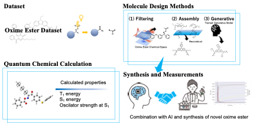

# Design Oxime Ester

## Overview

### oxime_ester_asembling

Contains the code of oxime ester assebling method

### ML

Containes prediction models and generative model

- ./ML/ABT-MPNN
  Graph base prediction model

- ./ML/deepa_neuralnetwork
  Dense Neuural network

- ./ML/MolGen
  SMILES base molecule Generative model
